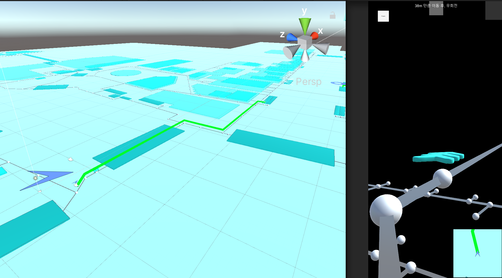

# Minimap

기본적으로 Navigation의 형태에 맞물려, 제공되는 기본 미니맵입니다. **NavigationBehaviour**를 상속받은 **MinimapViewerBehaviour**의 Static Method인 **Create**로 인스턴스를 생성할 수 있습니다. 생성된 인스턴스를 **Navigation Builder**에 엮어내면, 쉽게 미니맵을 구현할 수 있습니다.

SDK에서는 MinimapViewerBehaviour를 상속받은 **DefaultMinimapViewer**를 지원합니다. Editor에서 쉽게 미니맵 정보를 제어하도록 ScriptableObject 형태의 **DefaultMinimapViewerConfig**를 제공하며, 여기에는 아래와 같은 속성들이 있습니다.

```csharp

[CreateAssetMenu(fileName = "DefaultMinimapViewerConfig", menuName = ".../DefaultMinimapViewerConfig")]
/// <summary>
/// DefaultMinimapViewer를 구성하는 Configuration입니다
/// </summary>
public class DefaultMinimapViewerConfig : ScriptableObject
{
    [SerializeField] private RenderTexture minimapTexture;
    [SerializeField] private float initMinimapCameraSize = 2f;
    [SerializeField] private float cameraHeight = 5f;
    [SerializeField] private bool perspective = false;
    [SerializeField] float gradient = 60f;
    [SerializeField] private Material[] pathMaterials;
    [SerializeField] private MapRendererConfig minimapRendererConfig;
    [SerializeField] private GameObject currentPointIconPrefab = null;
    [SerializeField] private GameObject destinationIconPrefab = null;
    [SerializeField] private GameObject waypointIconPrefab = null;
    [SerializeField] private bool stickFloor = false;
    [SerializeField] private bool renderOnlyCurrent = true;
    [SerializeField] private bool renderMap = true;
    [SerializeField] private bool nodeLinkVisable = true;

    /// <summary>
    ///미니맵 카메라의 RenderTexture를 반환합니다
    /// </summary>
    public RenderTexture MinimapTexture => minimapTexture;

    /// <summary>
    /// 미니맵 카메라 사이즈를 반환합니다
    /// </summary>
    public float InitMinimapCameraSize => initMinimapCameraSize;

    /// <summary>
    /// 미니맵 카메라 높이를 반환합니다
    /// </summary>
    public float CameraHeight => cameraHeight;

    /// <summary>
    /// 기본 미니맵 카메라의 Perspective 설정 여부를 반환합니다
    /// </summary>
    public bool Perspective => perspective;

    /// <summary>
    /// brief 미니맵 카메라의 기울기 정도를 반환합니다
    /// </summary>
    public float Gradient => gradient;

    /// <summary>
    /// 미니맵 Path의 Material들을 반환합니다
    /// </summary>
    public Material[] PathMaterials => pathMaterials;

    /// <summary>
    /// MinimapRendererConfig를 반환합니다
    /// </summary>
    public MapRendererConfig MinimapRendererConfig => minimapRendererConfig;

    /// <summary>
    /// 현재 위치를 나타내는 GameObject를 반환합니다
    /// </summary>
    public GameObject CurrentPointIconPrefab => currentPointIconPrefab;

    /// <summary>
    /// 목적지 위치를 나타내는 GameObject를 반환합니다
    /// </summary>
    public GameObject DestinationIconPrefab => destinationIconPrefab;

    /// <summary>
    /// 경유지 위치를 나타내는 GameObject를 반환합니다
    /// </summary>
    public GameObject WaypointIconPrefab => waypointIconPrefab;

    /// <summary>
    /// 현재 위치를 나타내는 GameObject의 Floor 밀착 여부를 반환합니다
    /// </summary>
    public bool StickFloor => stickFloor;

    /// <summary>
    /// 현재 Spatial만 렌더링하는 속성의 여부를 반환합니다
    /// </summary>
    public bool RenderOnlyCurrent => renderOnlyCurrent;

    /// <summary>
    /// 미니맵 렌더링 여부를 반환합니다.
    /// </summary>
    public bool RenderMap => renderMap;

    /// <summary>
    /// Node, Link를 시각적으로 표시합니다
    /// </summary>
    public bool NodeLinkVisable => nodeLinkVisable;
}

```

## World Map Polygon Visualization (DefaultMinimapViewer)

**StartView** 함수를 호출하여, Minimap을 실행할 수 있습니다. Navigation Module의 **NavDataContainer**가 갖고 있는 현재 Spatial의 정보를 얻어서 Polygon Object를 만들어 미니맵 카메라에 렌더링되도록 합니다.

```csharp

public override async void StartView()
{
    this.MinimapTexture = this.config?.MinimapTexture;
    if (this.MinimapTexture == null)
    {
        this.MinimapTexture = new RenderTexture(512, 512, 16, RenderTextureFormat.ARGB32);
        this.MinimapTexture.Create();
    }

    // 다른 Location의 정보가 있었음을 고려하여, Navigation의 맵 정보 초기화
    Navigation.MapData.ClearAllMaps();
    var spatials = Navigation.navDataContainer.GetSpatials();

    if (config.RenderMap)
    {
        if (config.RenderOnlyCurrent)
        {
            RenderMap(CurrentSpatial);
        }
        else
        {
            // 현재 Spatial의 폴리곤 정보를 렌더링
            _TotalPolygonNum = spatials.ToList().Select(s => Navigation.MapData.GetSpatialData(s.Id).PolygonsFeatures.Count).Aggregate((a, b) => a + b);

            foreach (var spatial in spatials)
            {
                await RenderMap(spatial.Id);
            }
        }
    }

    CreateMinimapCamera();
    RenderCurrentPositionIcon();           

    // 미니맵 카메라의 Culling 작업
    Camera.main.cullingMask = ~(1 << MinimapLayer);

    Camera.main.cullingMask &= ~(1 << MapModelLayer);
    Camera.main.cullingMask &= ~(1 << CurrentMinimapLayer);
    Camera.main.cullingMask &= ~(1 << LayerMask.NameToLayer("ExtendedMinimap"));
    
    if (!config.NodeLinkVisable)
    {
        Camera.main.cullingMask &= ~(1 << LayerMask.NameToLayer("NODE"));
        Camera.main.cullingMask &= ~(1 << LayerMask.NameToLayer("LINK"));
    }

    base.StartView();
    getSpatials = spatials;
}

```

## Navigation Path Visualization (DefaultMinimapViewer)

Navigation의 Waypoints 정보를 읽어와, LineRenderer로 경로를 직접 그려줍니다.



**DefaultMinimapViewer**의 **OnUpdatePath**가 호출되면서 현재 **WayPoints**를 바탕으로, LineRenderer를 재구성합니다.

```csharp

...
public override void OnUpdatePath(Path path)
{
    // Preview에서 예상 경로를 렌더링하기 위해, 제공되는 로직.
    if (Navigation.State == NavStates.Ready)
    {
        ChangeSpatialViaActivatedPath(Navigation.ActiveWayPoints);
        changedSpatials = true;
        RenderPath(Navigation.ActiveWayPoints);
    }
    // 그 외, 네비게이션 중 발생하는 Path 업데이트 시, 호출되는 로직.
    else
    {
        RenderPath(Navigation.ActiveWayPoints);
    }
}
...

```