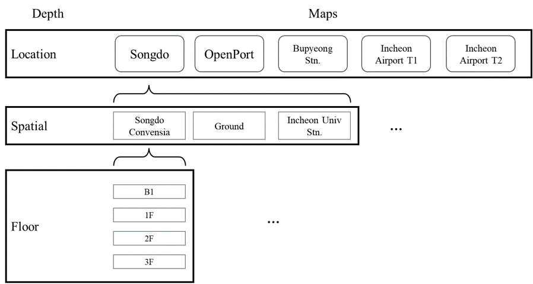
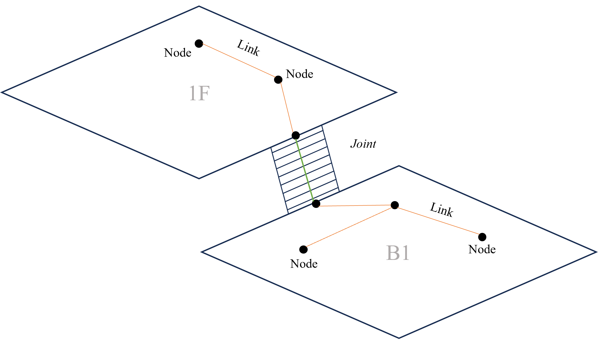
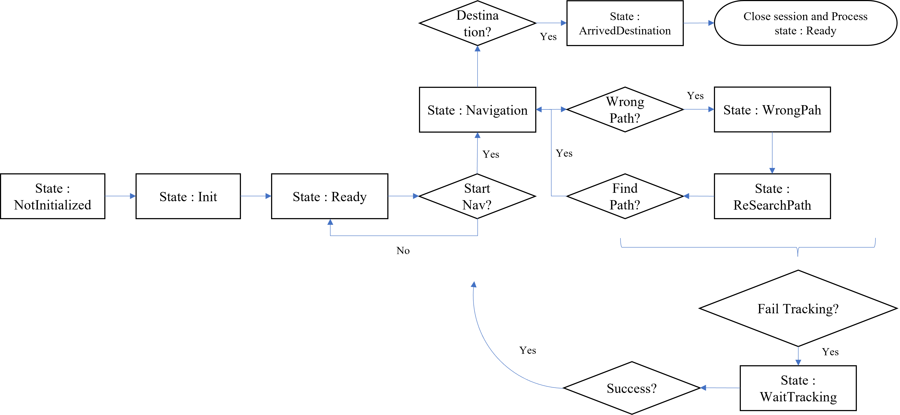

# NavigationModule

`NavigationModule`은 사업 내, 필수적인 내용이기에 다른 모듈과 다르게 `ISPRFCommonBase`를 구현한 일반 클래스 `SPRFBase`를 상속받아 구현되었습니다.

또한 Tracker에 의존해 동작하므로, `TrackerModule`가 Module Manager인 `SPRFManager`에 존재해야 합니다.

## Runtime

### Navigation Unit 구성

이음 프로젝트는 Geojson Format을 바탕으로 각 지역의 맵을 구성하고, 크게 3개의 Depth level 구조가 나뉘어져 있습니다.



Geojson 파일은 Floor 단위로 구성되어있고, 내부에는 건물 따위를 구성하는 Polygon 데이터, POI 정보, 그리고 Navigation 단위들을 구성하는 **Node**와 **Link**가 존재합니다.



경로 안내 구성은 Node와 Link 데이터, 그리고 동적으로 생성된 **Joint** 데이터로 행해집니다. Joint는 Geojson에서 Joint로 이어질 후보 Node들의 내부 데이터에 표기가 되어있고, Navigation에서는 이를 읽어, 동적으로 두 Floor를 연결하는 Joint를 생성합니다. 즉, Joint는 다른 Floor로 이동할 수 있는 수단에 있는 Node로 간주하면 되겠습니다.

### NavDataContainer

`NetworkModule`로부터 얻어온 현재 지역의 Navigation을 Pooling하기 위한 컨테이너입니다. 서비스에서는 다중 인터페이스를 통해, 제한적으로 접근이 가능합니다.

```csharp
public partial class Navigation : SPRFBase
{
    ...

    internal NavDataContainer navDataContainer = null;

    /// <summary>
    /// 서버로부터 받은 Node 정보
    /// </summary>
    public INodeDataContainer NodeData => navDataContainer;

    /// <summary>
    /// 서버로부터 받은 Link 정보
    /// </summary>
    public ILinkDataContainer LinkData => navDataContainer;

    /// <summary>
    /// 서버로부터 받은 목적지 정보
    /// </summary>
    public IDestinationDataContainer DestinationData => navDataContainer;

    /// <summary>
    /// 서버로부터 받은 Map 정보
    /// </summary>
    public IMapDataContainer MapData => navDataContainer;

    ...
}
```

Navigation에는 **Destination**이 존재하는데, Geojson내 POI 정보와 Node 정보를 조합하여 만든 것으로 네비게이션 안내 대상이 되는 지역을 뜻합니다.

### Waypoint

네비게이션을 통해 도착지를 지정하면, **Waypoints**가 형성이됩니다. Waypoints는 **Path**들로 구성이 되어 있고, Path는 출발지에서 도착지까지 안내된 경로이며, **A* Algorithm**으로 Path가 구성됩니다.

```csharp
public class WayPoints : IEnumerable<Path>
{
    ...

    List<Path> paths = new List<Path>();

    /// <summary>
    /// WayPoints의 Path들을 반환합니다
    /// </summary>
    public IReadOnlyList<Path> Paths => paths;

    /// <summary>
    /// WayPoints의 Path 중, 안내 중인 Path를 반환합니다
    /// </summary>
    public Path ActivePath => paths.FirstOrDefault();

    /// <summary>
    /// 최종 도착 노드를 반환합니다
    /// </summary>
    public Node DestinationNode => Paths.LastOrDefault().EndNode;

    /// <summary>
    /// 최종 도착 노드의 위치를 반환합니다
    /// </summary>
    public Vector3 DestinationPosition => DestinationNode != null? DestinationNode.Position : default;

    ...
}
```

내부 멤버 함수들을 통해, 경로 내 모든 Node들을 순차적으로 얻거나, 현재 위치로부터 남은 Node들의 정보를 얻을 수 있습니다. 이것을 통해, 서비스측은 네비게이션 실행 직전 Preview 기능을 쉽게 구현할 수 있습니다 (혹은 일시정지로 잔여 경로를 알 수 있습니다).

### Navigation

네비게이션은 기본적으로 아래와 같은 State를 갖고, 각 상태에 진입하게 되면 상태 전이 함수를 호출합니다. 이 때, Navigation을 구독하고 있는 인스턴스들에게 이벤트를 쏘아줍니다 (e.g. `NavigationBehaviour`와 같이, `INavigationEventHandler`를 구현한 클래스나 Navigation의 Event Handler).



Navigation은 TrackerModule과 Dependency가 존재하기 때문에, Tracker가 **Unrecognize** 상태로 돌입하면 무조건적으로 **WaitTracking** 상태로 진입하며, Tracker가 **Success**로 회귀하면, 이전 State로 돌아갑니다.

### Configuration

Navigation Module을 사용하기 위해서는, 인스턴스 구성을 위한 Configuration을 만들어야 합니다. 서비스에서 Builder로 다양한 형태의 네비게이션을 구성할 수 있도록 구현하였습니다.

```csharp

/// <summary>
/// 네비게이션 Configuration입니다
/// </summary>
public class Configuration
{
    internal List<INavigationEventHandler> NavigationEventHandlers;
    internal MinimapViewerBehaviour MinimapViewer;

    /// <summary>
    /// 네비게이션 Configuration의 Builder입니다
    /// </summary>
    public class Builder
    {
        private Configuration conf = new Configuration();

        /// <summary>
        /// 네비게이션 Configuration Builder를 생성합니다
        /// </summary>
        /// <returns>네비게이션 Configuration Builder를 반환합니다</returns>
        public static Builder Create()
        {
            return new Builder();
        }

        /// <summary>
        /// 네비게이션 Configuration에 미니맵 사용을 설정합니다
        /// </summary>
        /// <param name="minimapViewer">Configuration에 설정할 미니맵입니다</param>
        /// <returns>네비게이션 Configuration Builder를 반환합니다</returns>
        public Builder UseMinimap(MinimapViewerBehaviour minimapViewer)
        {
            ...
        }

        /// <summary>
        /// 네비게이션 Configuration에 NavigationEventHandler를 추가합니다
        /// </summary>
        /// <param name="handler">Configuration에 추가할 NavigationEventHandler입니다</param>
        /// <returns>네비게이션 Configuration Builder를 반환합니다</returns>
        public Builder AddNavigationEventHandler(INavigationEventHandler handler)
        {
            ...
        }

        /// <summary>
        /// 네비게이션 Configuration을 빌드합니다
        /// </summary>
        /// <returns>Configuration 빌드된 Configuration을 반환합니다</returns>
        public Configuration Build()
        {
            ...
        }
    }
}

```

아래와 같이 서비스에서 활용될 수 있습니다.

```csharp

...
private void Awake()
{
    Screen.sleepTimeout = SleepTimeout.NeverSleep;

    //네비게이션 설정
    Configuration conf = Configuration.Builder.Create()
        .AddNavigationEventHandler(this)    //네비게이션 이벤트 핸들러 지정
        .AddNavigationEventHandler(NavigationGuideRenderer.Instance)
        .AddNavigationEventHandler(NavigationExtendedMinimap.Instance)
        .AddNavigationEventHandler(MilestoneContainer.Create())
        .UseMinimap(DefaultMinimapViewer.Create(defaultMinimapViewerConfig))
        .Build();

    Navigation = new Navigation(conf);
}

...

```