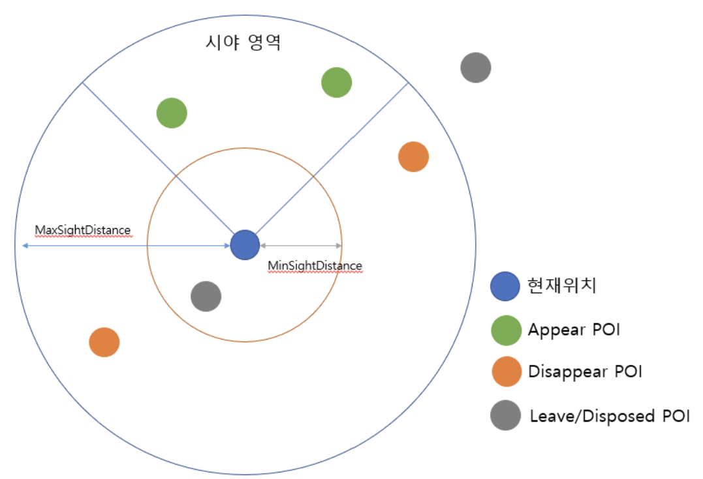

# POIModule

**Point Of Interest**로, 사용자의 관심 내용을 증강시키기 위한 정보의 단위입니다. **Navigation Module**과 마찬가지로, **TrackerModule**에 Dependency가 걸려있으며, 현재 사용자의 위치와 **SettingModule**로부터 설정된 POI 관련 설정 값에 의거해 **DataCenter**에 POI 정보를 요청합니다.

전달받은 POI 정보들 통해, 캐시된 POI 정보들을 갱신합니다.

## POIManager

POIModule의 헬퍼 대상이 되는 클래스로, 내부적으로 POI 관련 동작을 이행합니다.

```csharp

internal async UniTask RequestPOIs(bool isLocationChanged = false)
{
    await trackerModule.WaitSuccessState();

    ...

    var dataCenter = SPRFManager.Instance?.GetModule<DataCenterModuleBase>();
    var currentLocation = trackerModule.CurrentSpatial.Map.Location;

    // 현재 Unity 상 Tracker 좌표를 UTM으로 변환하여, API에 태울 준비
    UTM utmPosition = trackerModule.CurrentPosition.ToWorldPosition();

    ...

    // Setting 값과 Tracker 정보를 바탕으로 Feature 요청
    dataCenter.SearchFeatures(currentLocation, FeatureType.POI, utmPosition, networkInverval, maxValidHeight, null, null, features =>
    {
        dataCenter.RunOnMainThread(() =>
        {
            SPRFDebugger.Debug("[POIManager] RequestPOIs (Public) features returns {0}. Location ID : {1}, Position : {2}, MaxValidRegion: {3} Height: {4}, Location Changed : {5}"
                , features?.Count ?? 0, currentLocation.Id, utmPosition, networkInverval, maxValidHeight, isLocationChanged);

            if (features != null)
            {
                if (isLocationChanged || features.Count > 0)
                {
                    searchedPOIFeatures = features;
                    Load();
                }
            }

            SPRFDebugger.Debug("[POIManager] RequestPOIs End");
        });
    });
}

internal void Load()
{
    CreatePOIs();
    Search();
}

protected void CreatePOIs()
{            
    if (cts != null)
    {
        cts?.Cancel();
        cts?.Dispose();
        cts = null;
    }

    // POI내 POI가 자식으로 존재할 수 있기에, 재귀 탐색을 실행 (e.g. 던킨 도너츠 POI내에 3D Model POI나 Image POI 등이 존재할 수 있음)
    IEnumerable<IFeature> totalPOIFeatures = RecursivePOIUtil.GetTotalPOI(searchedPOIFeatures);

    var newPois = totalPOIFeatures?.Select(poi =>
    {
        var p = pois?.FirstOrDefault(pe => pe.ID == poi.Id);
        if(p == null)
        {
            p = new POI(poi, minValidRegion, maxValidRegion, minValidHeight, maxValidHeight);
            p.BindEvent(this);
        }

        return p;
    }).ToList();

    // 현재 위치 기반으로, 기존 캐시되었던 데이터들 갱신
    if (pois?.Count > 0)
    {
        var clearPois = pois.Except(newPois);
        foreach (var poi in clearPois)
        {
            poi.UnbindEvent();
        }

        // 이벤트 언바인딩
        var thisHandler = this as IPOIEventHandler;
        thisHandler.OnDisposingPOIList(clearPois);
    }

    pois?.Clear();
    pois = newPois;

    poisForPosition?.Clear();
    poisForPosition = pois?.GroupBy(key => key.WorldPosition)
                    .Select(poiGroup => new KeyValuePair<Vector3, IEnumerable<POI>>(poiGroup.Key, poiGroup))
                    .ToList();

    ...
}
```

서버로부터 혹은, DataCenter로부터 POI 정보를 가져왔다면, 실제 앱 단에서 렌더링 작업을 위해 Tracker 위치에 맞게 State를 부여합니다. 이 또한 Setting에 등록되어 있는 기본 설정 값에 의존합니다. 즉, 검색 Setting과 엔진 카메라에 담겨질 Setting이 분리되어 존재합니다.

```csharp

protected void Search()
{
    cts = new CancellationTokenSource();

    taskExecuter = new AsyncTaskExecuter(cts.Token);
    taskExecuter.RunAction(cancelToken => CalculatePOIs(cameraFov, cameraPosition, cameraForward, currentSpatialHeight, cancelToken));
}

protected void CalculatePOIs(float camFov, Vector3 camPosition, Vector3 camForward, float currentSpatialHeight, CancellationToken cancelToken)
{
    // 카메라 정보 초기화
    ...

    foreach (var poi in POIList)
    {
        if (cancelToken.IsCancellationRequested)
            return;

        poi.Calculate(camFov, camPosition, camForward, currentSpatialHeight);
    }

    ...
}

```

엔진 카메라 렌더링 영역, 혹은 그렇게 될 영역에 있는 POI 정보를 얻어왔다면, **POI** 인스턴스를 하나씩 순회하면서, State를 부여합니다. POI들은 State를 받아, 이에 대한 이벤트를 발행합니다.

```csharp

public class POI : IPOI, IEquatable<POI>
{
    ...

    internal void Calculate(float camFOV, Vector3 camPosition, Vector3 camForward, float currentSpatialHeight)
    {
        POIState willbeState = POIState.None;

        // 현재 카메라 기준, POI가 보여질지, 숨겨질지, 지나쳐옴 처리가 될 지에 대한 Threshold 결정.
        ...

        if (distance >= minDistance && distance <= maxDistance &&
            WorldPosition.y >= minHeight && WorldPosition.y <= maxHeight)
        {
            if (Vector3.Dot(direction.normalized, camForward) > dotValue)
            {
                willbeState = POIState.Appear;      // 카메라에 나타날 수 있음
            }
            else
            {
                willbeState = POIState.Disappear;   // 인스턴스는 존재하지만, Culling 될 수 있음
            }
            enter = this.state.Value != willbeState;
        }
        else
        {
            willbeState = POIState.Leave;           // 지나쳐 왔기 때문에, 인스턴스가 사라질 수 있음
        }

        ...

        this.state.Value = willbeState;
        this.distance.Value = distance;
    }

    ...
}

```

따라서, POI는 아래와 같은 상태를 가질 수 있습니다.



물론, SDK에서는 적정한 Event만 던져줄 뿐, 실제 작업은 서비스 사 입 맛에 맞게 작업할 수 있습니다 (Disappear 상태임에도 불구하고, 엔진에 렌더링 할 수 있음).

## 적용 예제

위 내용을 토대로, SDK Sample에 동봉되어 있는 POIMoudle 적용 예제입니다.

```csharp

public class SamplePOIManager : MonoBehaviour, IPOIEventHandler
{
    // 필드 초기화
    ...

    void Awake()
    {
        // 모듈 초기화 및 이벤트 부착
        ...
    }

    ...

    /// <summary>
    /// POI 상태 변경시
    /// </summary>
    /// <param name="poi">상태가 변경된 POI 인스턴스</param>
    /// <param name="state">해당 POI의 State</param>
    public void OnChangePOIState(IPOI poi, POIState state)
    {
        switch(state)
        {
            case POIState.Enter:    //POI가 감지 영역안에 들어왔을때
                Enter(poi);
                break;
            case POIState.Appear:   //POI가 렌더링 영역안에 들어왔을때
                Appear(poi);
                break;
            case POIState.Disappear:    //POI가 렌더링 영역에서 나갔을때
                Disappear(poi);
                break;
            case POIState.Leave:    //POI가 감지 영역에서 나갔을때
                Leave(poi);
                break;
            case POIState.Dispose:  //POI 폐기 되었을때(SDK에서 관리하지 않음)
                Dispose(poi);
                break;
        }
    }

    //Enter Event
    private void Enter(IPOI poi)
    {
        // POI를 생성하고 Pooling하며, POI Layer를 설정합니다.
        if (!createdPOIDict.ContainsKey(poi.ID))
        {
            GameObject o = Instantiate(PoiPrefab, poiGroup);
            LayerUtil.ChangeLayersRecursively(o.transform, poiLayer);
            o.transform.position = poi.WorldPosition + (Vector3.up * 1.5f);

            SamplePOI s = o.GetComponent<SamplePOI>();            
            s.Init(poi);

            createdPOIDict.Add(poi.ID, o);
        }
    }

    //Appear Event    
    private void Appear(IPOI poi)
    {
        if (createdPOIDict.ContainsKey(poi.ID))
            createdPOIDict[poi.ID].SetActive(true);
    }

    //Disappear Event
    private void Disappear(IPOI poi)
    {
        if (createdPOIDict.ContainsKey(poi.ID))
            createdPOIDict[poi.ID].SetActive(false);
    }

    //Leave Event
    private void Leave(IPOI poi)
    {
        Dispose(poi);
    }

    private void Dispose(IPOI poi)
    {
        if (createdPOIDict.ContainsKey(poi.ID))
        {
            var o = createdPOIDict[poi.ID];
            createdPOIDict.Remove(poi.ID);
            Destroy(o);
        }
    }

    /// <summary>
    /// 더이상 POI관리자가 관리하지을 대상(Dispose POI)
    /// 이후 POI Event가 발생하지 않음
    /// 여기서 따로 캐시한 POI가 있다면 제거 필요
    /// </summary>
    /// <param name="poiLists"></param>
    public void OnDisposingPOIList(IEnumerable<IPOI> poiLists)
    {
        foreach (var poi in poiLists)
        {
            Dispose(poi);
        }
    }
}

```