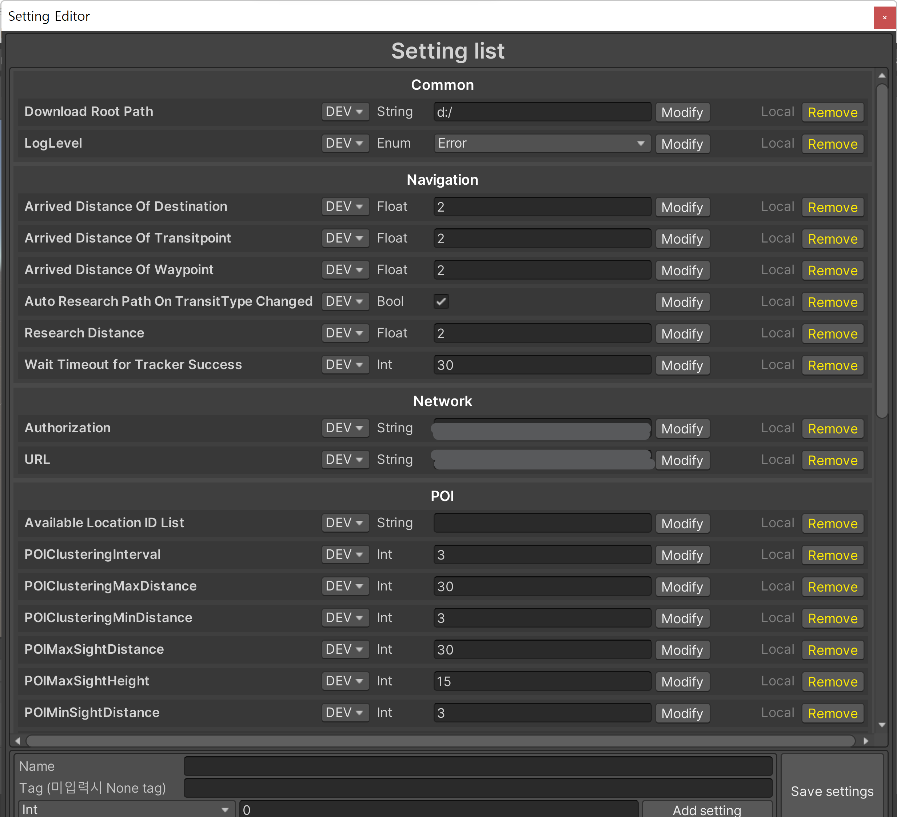

# SettingModule

SDK를 이용하는 모든 서비스에 대해 공통적인 Setting을 제공하고, 각 서비스사에서 그들에 맞게, 새롭게 Setting을 추가할 수 있는 기능.

## Runtime

### SettingAttribute

Setting 값으로 간주될 (SettingEditor 윈도우에서 편집이 가능한 상태), Field 위에 작성됩니다. `CustomAttribute` 형태로 구현되었으며, 다양한 타입의 데이터를 지원합니다.

- IntSettingAttribute
- FloatSettingAttribute
- StringSettingAttribute
- BoolSettingAttribute
- EnumSettingAttribute

```csharp

public class SettingAttribute : Attribute
{
    string settingName;

    /// <summary>
    /// Setting의 Key입니다
    /// </summary>
    public string SettingName
    {
        get { return this.settingName; }
        set { this.settingName = value; }
    }

    string settingTag = ConstantValues.SettingDefaultTag;

    /// <summary>
    /// Setting의 Tag입니다
    /// </summary>
    public string SettingTag
    {
        get { return this.settingTag; }
        set { this.settingTag = value; }
    }

    EOpenType openType = EOpenType.DEV;

    /// <summary>
    /// Setting의 오픈 타입입니다
    /// </summary>
    public EOpenType OpenType
    {
        get { return this.openType; }
        set { this.openType = value; }
    }

    [JsonIgnore]
    internal MemberInfo member;

    [JsonIgnore]
    internal ISPRFCommonBase sprfBase;

    [JsonIgnore]
    internal Accept accept;

    /// <summary>
    /// Setting의 생성자입니다
    /// </summary>
    /// <param name="name">Key값 입니다</param>
    /// <param name="tag">Tag값 입니다</param>
    public SettingAttribute(string name, string tag = null)
    {
        this.settingName = name;
        this.settingTag = tag == null || tag == string.Empty ? ConstantValues.SettingDefaultTag : tag;
        this.accept = AcceptData;
    }

    internal virtual void AcceptData(ISPRFCommonBase sprfBase, MemberInfo member, object value)
    {
        FieldInfo fieldInfo = member as FieldInfo;
        if (fieldInfo != null)
        {
            try
            {
                fieldInfo.SetValue(sprfBase, value);
            }
            catch (ArgumentException argE)
            {
                SPRFErrorListener.Check(SPRFResult.InvalidArgument,
                    "[SettingModule] 필드 (" + member.Name + ", " + member.MemberType + ")와 Setting (" + value + ", " + value.GetType() + ")의 타입이 일치하지 않습니다.",
                    needthrowerror: true);
            }
        }
        else
        {
            SPRFErrorListener.Check(SPRFResult.Failure,
                    "[SettingModule] 부적절한 필드 (" + member.Name + ")에 Setting을 적용할 수 없습니다.",
                    needthrowerror: true);
        }
    }
}

/// <summary>
/// Int형의 Value값을 갖는 Setting attribute입니다
/// </summary>
public class IntSettingAttribute : SettingAttribute
{
    int? settingValue = null;

    /// <summary>
    /// Int형 Setting의 Value입니다
    /// </summary>
    public int? SettingValue
    {
        get { return this.settingValue; }
        set { this.settingValue = value; }
    }

    /// <summary>
    /// Int형 Setting의 생성자입니다
    /// </summary>
    /// <param name="name">Setting의 Key값 입니다</param>
    public IntSettingAttribute(string name) : base(name) { }

    /// <summary>
    /// Int형 Setting의 생성자입니다
    /// </summary>
    /// <param name="name">Setting의 Key값 입니다</param>
    /// <param name="value">Setting의 Value값 입니다</param>
    /// <param name="tag">Setting의 Tag값 입니다</param>
    [JsonConstructor]
    public IntSettingAttribute(string name, int value, string tag = null) : base(name, tag)
    {
        SettingValue = value;
    }

    internal override void AcceptData(ISPRFCommonBase sprfBase, MemberInfo member, object value)
    {
        base.AcceptData(sprfBase, member, value);
        SettingValue = (int)value;
    }
}

...
```

`ISPRFCommonBase`를 구현한 스크립트 내에서, SettingModule가 초기화를 이행하면서, `AcceptData`로 필드에 Setting값을 주입합니다.

### SettingModule

#### Init

Setting의 초기화, 갱신, 이벤트 연결 등의 기능을 지원합니다. 일반 `ModuleBase`를 상속받아 구현되었습니다. 다른 `ModuleBase`보다, 우선적으로 초기화 과정을 진행합니다.

```csharp
[Serializable]
public partial class SettingModule : ModuleBase
{
    ...
    
    public void Init()
    {
        var saved = LoadSavedSettings();    // Local Directory에 저장된 Setting 호출
        var inline = LoadInlineSettings();  // Script내 장석된 (Attribute 형태) Setting 호출
        var merged = MergeSavedWithInline(saved, inline);   // 병합
        
        // 중복 제거
        // - 로컬에 저장된 Setting 값이 가장 우선적으로 채택됨.
        // - 로컬에 없는 신규 Setting인 경우, Reflection 우선 값 사용 (해당 값에 문제가 있다면, 다음 순번 채택).
        var initialized = ValidateSettings(merged).OrderBy(x => x.SettingName).ToList();

        ...

    }
}
```
Local에 저장된 Setting은 FileStream과 JsonSerializer를 통해, 적절히 Deserialized됩니다.

#### Update

Update는 playmode, Editor 모두 지원하며, 지정된 Setting에 연결된 이벤트가 있다면 Invoke합니다.

```csharp
public partial class SettingModule : ModuleBase
{
    ...

    public void UpdateSetting(string name, object value)
    {
        if (value == null)
        {
            SPRFDebugger.Warning("대충 Null값 설정은 불가하다는 내용");
            return;
        }
            
        var found = FindSetting(settingList, settingName);

        if (found == null)
        {
            SPRFDebugger.Warning("대충 그런 Setting은 없다는 내용");
            return;
        }
        else
        {
            InvokeBySettingType(found,
                () => AcceptUpdatedValue<IntSettingAttribute>((found as IntSettingAttribute), (found as IntSettingAttribute).SettingValue, (int?)value),
                () => AcceptUpdatedValue<FloatSettingAttribute>((found as FloatSettingAttribute), (found as FloatSettingAttribute).SettingValue, (float?)value),
                () => AcceptUpdatedValue<StringSettingAttribute>((found as StringSettingAttribute), (found as StringSettingAttribute).SettingValue, (string)value),
                () => AcceptUpdatedValue<BoolSettingAttribute>((found as BoolSettingAttribute), (found as BoolSettingAttribute).SettingValue, (bool?)value),
                () => AcceptUpdatedValue<EnumSettingAttribute>((found as EnumSettingAttribute), (found as EnumSettingAttribute).SettingValue.Selected, (int)value));
        }
    }

    ...
}
```

이후, `AcceptUpdatedValue`가 실행됨에 따라, 해당 SettingName을 갖는 모든 Setting의 FieldInfo의 값들을 갱신하고 Update 이벤트를 Invoke합니다.

## Editor

### SettingEditor

Setting에 대해, EditorMode에서 CRUD를 이행할 수 있는 EditorWindow 입니다. PlayMode 진입 시, ReadOnly만 가능토록 구현되었습니다.




