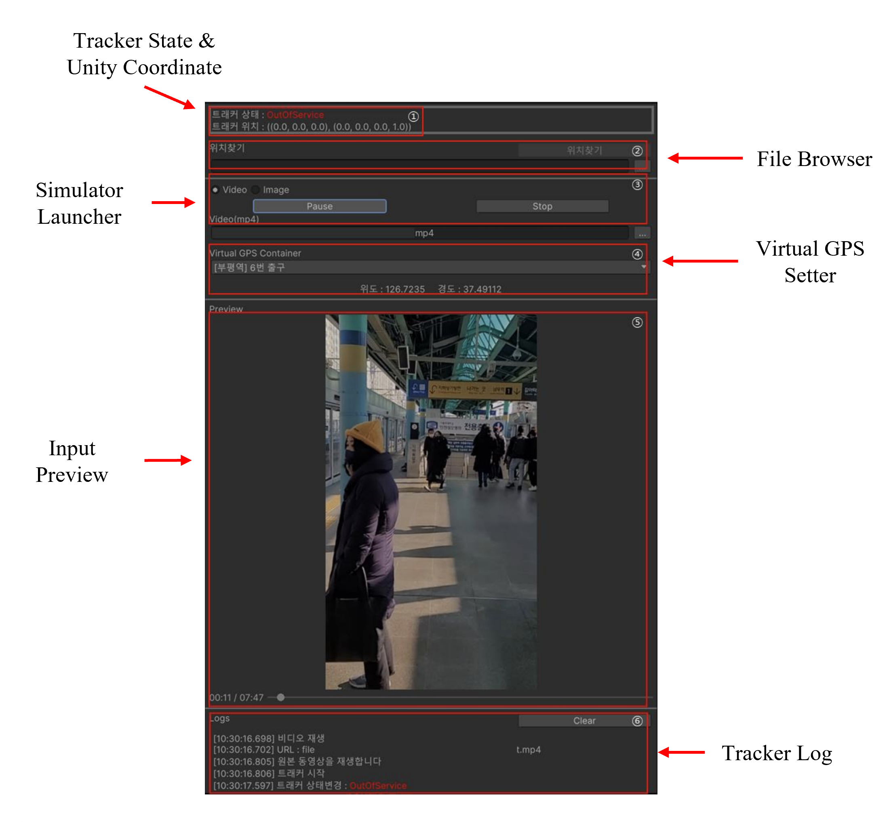
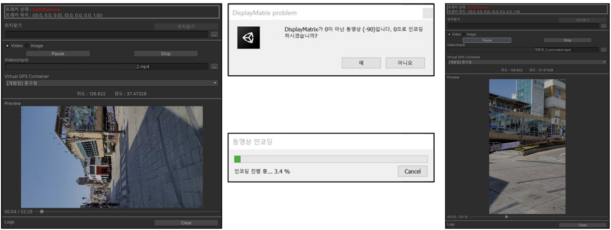

# TrackerModule

실제 구동 Tracker 기능을 수행하는 **TrackerController**의 헬퍼 클래스입니다. 서비스에서 직접 Tracker를 제어할 수 있는 기능을 지원하지만, **POIModule**이나 **Navigation**에 Dependency가 존재하기 때문에, 둘 중, 하나의 모듈만 존재하더라도, 자동적으로 Tracker Reset을 진행합니다.

## Runtime

### EventHandler

Tracker의 상태 변화나, Spatial 변화 따위의 이벤트를 발행합니다.

```csharp

/// <summary>
/// 트래커 상태
/// </summary>
public override TrackerState State => trackerController?.State ?? TrackerState.None;

/// <summary>
/// 트래커 상태 변경 이벤트
/// </summary>
public override event SPRFEventHandler<TrackerState> TrackerStateChanged;

/// <summary>
/// 지역 변경 이벤트
/// 지역 변경이 일어나면 변경된 지역의 Spatial ID 를 리턴
/// </summary>
public override event SPRFEventHandler<int> SpatialChagned;

/// <summary>
/// 위치 변화시
/// </summary>
public override event SPRFEventHandler<Pose> PoseUpdated;

/// <summary>
/// 사물인식
/// </summary>
public override event SPRFEventHandler<DetectedObject> ObjectDetected;

/// <summary>
/// GPS 초기화
/// </summary>
public override event SPRFEventHandler GPSInitialized;

/// <summary>
/// 위치 변경시 기존 위치와 변화된 위치 정보
/// </summary>
public override event SPRFEventHandler<Vector3, Vector3> PositionMoved;

/// <summary>
/// 지역 이름이 변경
/// </summary>
public override event SPRFEventHandler<string> LocationNameChanged;

/// <summary>
/// 건물 이름이 변경
/// </summary>
public override event SPRFEventHandler<string> BuildingNameChanged;

/// <summary>
/// 층 이름이 변경
/// </summary>
public override event SPRFEventHandler<string> FloorNameChanged;

/// <summary>
/// 맵 코드가 변경
/// </summary>
public override event SPRFEventHandler<string> MapCodeChanged;

/// <summary>
/// 층 이동 시작
/// </summary>
public override event SPRFEventHandler StartChangingFloor;

```

### Function

`SendTrackerImage`를 통해서 **TrackerController**에게 DebuggingTexture를 전달합니다. 따라서, 해당 함수는 EditorMode에서 Simulate 과정에 사용됩니다.

```csharp
/// <summary>
/// 시뮬레이션을 위한 이미지 (렌더) 텍스쳐를 입력합니다.
/// </summary>
/// <param name="tex">이미지 (렌더) 텍스쳐</param>
public override void SendTrackerImage(Texture tex) {...}
```

`Reset`, `Stop` 등의 기능을 지원하여, 서비스에서 원하는 상황에 Tracker를 동작시킬 수 있습니다.

```csharp
/// <summary>
/// 트래커를 리셋합니다.
/// </summary>
public override void Reset()
{
    SPRFDebugger.Info("[TrackerModule] Reset Tracker");
    trackerController?.Reset();
}

/// <summary>
/// 트래킹을 종료합니다.
/// </summary>
public override void Stop()
{
    if(started)
    {
        trackerController?.Stop();
        started = false;
    }
}
```

### Initialize

`TrackerController`는 2가지 형태가 존재합니다. *학습된 Tracker가 반드시 공간 인식을 성공한다는 보장이 없기 때문*에, *인식이 정상적으로 성공되었음을 가정하고 Success만을 반환*하는 **SimulationTrackerController**와 실제 Tracker를 사용하는 **ANTrackerController**가 존재합니다.

특히, **ANTrackerController**는 실제로 Texture Input을 받기 때문에, 직접 이미지 정보를 입력해야 하며, 이는 EditorWindow 형태로 구현되어 있습니다 (**Simulator 참고**).

따라서, 각기 다른 형태로 초기화할 필요가 있기 때문에, TrackerModule의 초기화 절차는 아래와 같이 두 가지 방향으로 진행됩니다.

```csharp

/// <summary>
/// 트래커를 초기화 합니다.
/// </summary>
/// <param name="trackerType">초기화 할 트래커 유형</param>
/// <returns>초기화 성공 여부</returns>
public override bool Init(TrackerType trackerType = TrackerType.Default)
{
    if (initialized)
        return true;

    ...

    m_trackerType = trackerType;

    switch (m_trackerType)
    { 
        case TrackerType.Simulation:
            trackerController = new SimulationTrackerController();  // 시뮬레이션 트래커
            break;

        case TrackerType.SPRF:
        default:
            trackerController = new ANTrackerController();          // 네이버 트래커
            break;
    }

    ...

    initialized = trackerController.Init();
    if(initialized)
        BindEvent();    // TrackerController에 이벤트 바인딩하기 위한 함수

    return initialized;
}

```

- **SimulationTrackerController**의 경우, **SettingEditor**를 통해 직접 시뮬레이션 할 지역 명을 입력해야 동작합니다.
- **ANTrackerController**의 경우, **SimulatorWindow**에서 동영상, 이미지 정보를 입력함과 동시에, 해당 영상이 촬영된 지역의 위도-경도를 입력해야 합니다.

### TrackerController

#### ANTrackerController

Naver의 Tracker SDK를 직접 동작시키는 Controller로, ANTracker가 공간 인식에 의거하여 사물을 증강시킬 때, **ARFoundation**와 상호작용하여 보간합니다. 따라서, 초기화 단계에서 직접 ARFoundation 관련 GameObject들을 생성하고 ANTracker의 GameObject에 바인딩합니다.

#### SimulationTrackerController

실제 트래커의 인식 성공을 모의하도록 설계된 Controller로, 사용자는 **W**,**A**,**S**,**D**로 직접 트래커를 컨트롤 할 수 있습니다. ANTracker의 지속적인 유지보수 시, 서비스의 개발을 이어갈 수 있도록 설계된 방법입니다.

**ARFoundation**과 별도의 Dependency는 존재하지 않으며, 빌드 시 다시 ANTrackerController로 타겟하도록 설정하였습니다.

## Editor

### Simulator

**ANTrackerController**를 테스트 및 디버깅할 수 있도록 Input을 밀어 넣어주는 기능을 지원합니다. Input 값은 아래와 같이 구성됩니다.

- 단일 이미지 : File Browser를 통해, 이미지 경로를 입력합니다.
- 이미지 리스트 : 별도의 Editor 코드로 추가 구성되어, 이미지들의 경로와 그것들을 순차적으로 입력할 Interval 값이 담긴 Json 파일을 File Browser로 입력합니다.
- 동영상 : File Browser를 통해, 동영상 경로를 입력합니다.

화면 구성은 아래와 같습니다.



#### FFMPEG

단말기로 **Simulator** 동작용 영상을 촬영해왔더니, 영상이 가로로 드러누워버리는 현상이 있어, 추가 인코딩 지원을 목적으로 삽입된 플러그인입니다.



Raw Video의 Display Matrix를 0으로 수정하며, FFmpeg의 헬퍼 [라이브러리](https://github.com/cmxl/FFmpeg.NET)를 사용하였습니다.